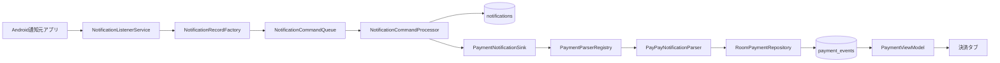
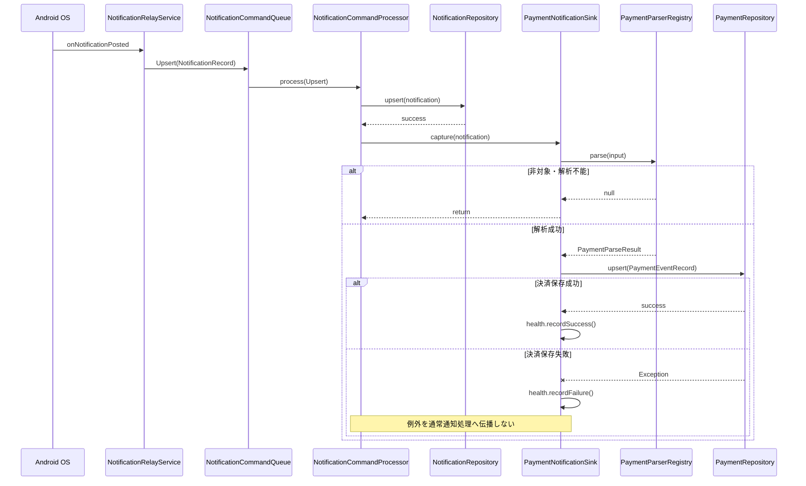
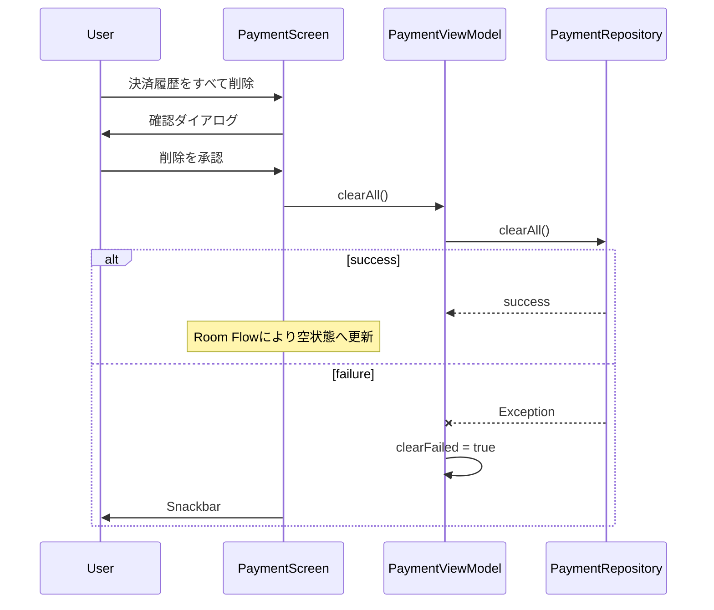

# 決済インボックス機能設計書

- 文書状態: Draft（PR #28 実装対応版）
- 対象アプリ: 通知箱 Android
- 対象機能: 決済インボックス（ベータ）
- 対象バージョン: v0.1.x 技術ベータ
- 最終更新日: 2026-07-26
- 関連仕様書: [`payment-inbox-spec-ja.md`](payment-inbox-spec-ja.md)

## 1. 設計方針

決済インボックスは、既存の通知取込経路を置き換えず、通常の通知履歴から決済イベントを派生させる追加機能として設計する。

最重要の設計原則は次のとおり。

1. **通知履歴を正、決済イベントを派生データとする。**
2. **通常の通知保存を先に完了させる。**
3. **決済解析・保存の失敗を通常の通知取込へ伝播させない。**
4. **通知本文を決済テーブルへ複製しない。**
5. **対応アプリごとの解析器をPure Kotlinで分離する。**
6. **同一通知キーに対して冪等に保存する。**
7. **ネットワーク、外部AI、クラウドを設計へ持ち込まない。**

## 2. システムコンテキスト



### 2.1 境界

- Android通知取得境界: `NotificationRelayService`
- 通知保存境界: `NotificationRepository`
- 決済派生境界: `PaymentNotificationSink`
- 解析戦略境界: `PaymentNotificationParser`
- 永続化境界: `PaymentRepository`
- 表示境界: `PaymentViewModel` / `PaymentScreen`

## 3. パッケージ構成

```text
app/src/main/java/com/notificationbox/app/
├── data/
│   ├── db/
│   │   ├── NotificationDatabase.kt
│   │   ├── PaymentEventEntity.kt
│   │   ├── PaymentEventDao.kt
│   │   └── PaymentSummaryRow.kt
│   └── repository/
│       ├── PaymentRepository.kt
│       └── RoomPaymentRepository.kt
├── domain/
│   └── payment/
│       ├── PaymentModels.kt
│       └── PayPayNotificationParser.kt
├── service/
│   ├── NotificationCommandProcessor.kt
│   ├── NotificationRelayService.kt
│   ├── PaymentNotificationSink.kt
│   └── PaymentIngestionHealthStore.kt
└── ui/
    ├── NotificationBoxApp.kt
    ├── NotificationHomeScreen.kt
    └── payment/
        ├── PaymentViewModel.kt
        └── PaymentScreen.kt
```

### 3.1 責務

| コンポーネント | 責務 | 持たせない責務 |
|---|---|---|
| `NotificationRelayService` | Android通知イベントを既存キューへ渡す | 決済文面の解析 |
| `NotificationCommandProcessor` | 通知保存後に決済派生処理を呼ぶ | 解析ルール、Room SQL |
| `PaymentNotificationSink` | 通知レコードを決済派生処理へ橋渡しする | UI状態管理 |
| `PaymentParserRegistry` | 対応パーサー選択 | 個別アプリの解析ロジック |
| `PayPayNotificationParser` | PayPay文面の正規化・抽出・判定 | Android API、Room、UI |
| `PaymentRepository` | 決済データの抽象I/O | 文面解析 |
| `RoomPaymentRepository` | Entity変換、DAO呼出し | Android通知取得 |
| `PaymentEventDao` | 保存、一覧、集計、全消去 | ビジネス判定 |
| `PaymentViewModel` | Flow結合、UI状態、削除操作 | SQL、通知文面解析 |
| `PaymentScreen` | 表示、確認ダイアログ、ユーザー操作 | 永続化、解析 |

## 4. 取込シーケンス

### 4.1 通常投稿



### 4.2 アクティブ通知再同期

`SynchronizeActive`では、既存通知リポジトリによる同期完了後、同期対象の各`NotificationRecord`を決済Sinkへ渡す。

同一OS通知は`sourceNotificationKey`を主キーとする`@Upsert`で更新されるため、再接続・再同期で行数が増えない。

### 4.3 処理順序の理由

決済保存を通知保存より先に実行すると、決済DB障害が原因で通常の通知履歴まで失われる可能性がある。したがって、以下の順序を固定する。

```text
通常通知保存（必須）
  ↓ 成功後のみ
決済解析・保存（付加処理）
```

## 5. ドメインモデル

### 5.1 入力モデル

```kotlin
PaymentNotificationInput(
    packageName: String,
    appLabel: String,
    title: String?,
    text: String?,
    postTimeMillis: Long
)
```

入力モデルはAndroidの`StatusBarNotification`を直接参照しない。既存の`NotificationRecord`から必要最小限を変換し、解析器をPure Kotlinとして維持する。

### 5.2 解析結果

```kotlin
PaymentParseResult(
    amountYen: Long,
    merchantName: String?,
    transactionType: PaymentTransactionType,
    confidencePercent: Int,
    parserId: String,
    parserVersion: Int
)
```

### 5.3 取引種別

```kotlin
PURCHASE
REFUND
CHARGE
TRANSFER_OUT
TRANSFER_IN
UNKNOWN
```

`UNKNOWN`は「金額を含む取引完了通知だが、支払い・返金等の種別を確定できない」場合に限定する。単なる金額表示は`null`を返し、イベント自体を作成しない。

## 6. パーサー設計

### 6.1 インターフェース

```kotlin
interface PaymentNotificationParser {
    fun supports(packageName: String): Boolean
    fun parse(input: PaymentNotificationInput): PaymentParseResult?
}
```

- `supports`: パッケージ名による明示的な対応判定
- `parse`: 対象外・解析不能・保存すべきでない通知では`null`
- 例外: 想定外の実装不具合を除き、通常の非対象判定へ例外を使わない

### 6.2 Registry

```kotlin
class PaymentParserRegistry(
    private val parsers: List<PaymentNotificationParser>
)
```

Registryは最初に`supports`が真となる解析器だけを使用する。

初期登録:

```text
PayPayNotificationParser
```

将来の追加例:

```text
RakutenCardNotificationParser
PayPayCardNotificationParser
SuicaNotificationParser
```

対応アプリ追加時は、別パーサーとfixtureテストを追加し、Registryへ登録する。既存PayPayパーサーへ他社文面を混在させない。

### 6.3 PayPay解析パイプライン

```text
1. パッケージ名一致
2. title + text を改行で結合
3. Unicode NFKC正規化
4. 空文字判定
5. 販促キーワード除外
6. 円金額抽出
7. 取引種別判定
8. UNKNOWN時の汎用取引完了文言確認
9. 店舗名抽出
10. 信頼度算出
11. PaymentParseResult生成
```

### 6.4 正規化

`Normalizer.Form.NFKC`を使用する。

目的:

- 全角数字を半角へ統一
- 全角カンマを半角へ統一
- 全角記号の表記揺れを縮小

例:

```text
５，０００円 → 5,000円
￥１，２８０ → ¥1,280
```

### 6.5 金額抽出

対応正規表現:

```text
([0-9][0-9,]*)\s*円
[¥￥]\s*([0-9][0-9,]*)
```

抽出後にカンマを除去し、`Long`へ変換する。

設計上の制限:

- 最初に一致した円金額を採用する。
- 外貨記号、少数、小数点、換算は扱わない。
- `Long`変換に失敗した場合は`null`。
- 金額範囲の恣意的な上限はMVPで設けない。実通知fixtureから必要性を判断する。

### 6.6 販促除外

除外語:

- キャンペーン
- クーポン
- ポイント還元
- 抽選
- 当たる

販促除外は金額抽出より前に実施する。これにより「最大1,000円相当が当たる」等を取引として保存しない。

### 6.7 取引種別優先順位

```text
REFUND
  > CHARGE
  > TRANSFER_IN
  > TRANSFER_OUT
  > PURCHASE
  > UNKNOWN
```

返金通知に「お支払い」という元取引の表現が含まれる場合でも、返金を優先する。

### 6.8 店舗名抽出

優先順:

1. ラベル形式
   - `利用先：...`
   - `支払先：...`
   - `店舗：...`
   - `お店：...`
2. 文形式
   - `...でのお支払い`
   - `...での支払い`
   - `...で決済`

抽出後処理:

- 最初の行だけを採用
- 前後空白と括弧類を除去
- 1〜80文字のみ採用
- 補完・推測・外部検索を行わない

### 6.9 信頼度

| 条件 | 信頼度 |
|---|---:|
| 種別確定かつ店舗名あり | 95 |
| 種別確定、店舗名なし | 85 |
| 汎用取引完了、種別不明 | 60 |

信頼度は現時点ではUIの主要表示や自動確定制御に使用しない。将来のレビュー機能、解析品質評価、パーサー移行判断のために保存する。

### 6.10 解析器バージョン

PayPay解析器の初期確定版は`parserVersion = 2`とする。

バージョンを上げる条件:

- 抽出結果が変わる正規表現変更
- 取引種別の優先順位変更
- 誤検出除外条件の変更
- 店舗名抽出ロジックの変更

単なるリファクタリングで出力が変わらない場合は上げなくてもよい。

## 7. 永続化設計

### 7.1 テーブル

```sql
CREATE TABLE payment_events (
    sourceNotificationKey TEXT NOT NULL,
    packageName TEXT NOT NULL,
    appLabel TEXT NOT NULL,
    amountYen INTEGER NOT NULL,
    merchantName TEXT,
    transactionType TEXT NOT NULL,
    occurredAtMillis INTEGER NOT NULL,
    parserId TEXT NOT NULL,
    parserVersion INTEGER NOT NULL,
    confidencePercent INTEGER NOT NULL,
    status TEXT NOT NULL DEFAULT 'UNREVIEWED',
    PRIMARY KEY(sourceNotificationKey)
)
```

### 7.2 Index

```sql
CREATE INDEX index_payment_events_occurredAtMillis
ON payment_events(occurredAtMillis);

CREATE INDEX index_payment_events_packageName
ON payment_events(packageName);

CREATE INDEX index_payment_events_transactionType
ON payment_events(transactionType);
```

用途:

- `occurredAtMillis`: 新しい順の表示、期間集計
- `packageName`: 将来のアプリ別絞り込み・削除
- `transactionType`: 集計・要確認抽出

初期画面ではpackageName絞り込みを使用しないが、対応アプリ追加を見越してindexを定義する。

### 7.3 主キーと冪等性

`sourceNotificationKey`を主キーとし、Roomの`@Upsert`を使用する。

利点:

- リスナー再接続同期で重複しない
- 同じ通知の内容更新を反映できる
- 別途dedupテーブルやロックを追加しない

制約:

- 同一取引が別通知キーで複数回通知された場合は重複する。
- 意味的重複判定は誤統合リスクがあるためMVP対象外とする。

### 7.4 通知本文を保存しない理由

- 決済テーブルの長期保持期間が通知履歴より長い。
- 本文複製は情報露出面積を増やす。
- 解析済みイベント表示には原文が必須ではない。
- 原文は既存通知履歴側の保持方針に従う。

保存する派生情報は次に限定する。

- 金額
- 店舗名
- 取引種別
- 通知元アプリ情報
- 発生時刻
- 解析器情報
- 信頼度
- 将来の確認状態

### 7.5 DAO

```kotlin
fun observeAll(): Flow<List<PaymentEventEntity>>
fun observeSummarySince(sinceMillis: Long): Flow<PaymentSummaryRow>
suspend fun upsert(entity: PaymentEventEntity)
suspend fun clearAll()
```

一覧はSQLの`LIMIT 500`で制限する。UI側で全件ロード後に切り詰めない。

### 7.6 月次集計SQL

```sql
SELECT
    COUNT(*) AS eventCount,
    COALESCE(
        SUM(CASE WHEN transactionType = 'PURCHASE' THEN amountYen ELSE 0 END),
        0
    ) AS purchaseTotalYen,
    COALESCE(
        SUM(CASE WHEN transactionType = 'REFUND' THEN amountYen ELSE 0 END),
        0
    ) AS refundTotalYen,
    COALESCE(
        SUM(CASE WHEN transactionType = 'UNKNOWN' THEN 1 ELSE 0 END),
        0
    ) AS needsReviewCount
FROM payment_events
WHERE occurredAtMillis >= :sinceMillis
```

`netSpendYen`はRepositoryモデルで次のように導出する。

```kotlin
purchaseTotalYen - refundTotalYen
```

チャージ・送受金を支出へ含めない。資金移動と消費を混同しないためである。

## 8. Room migration設計

### 8.1 Version

```text
旧: 3
新: 4
```

### 8.2 Migration 3→4

- `payment_events`テーブル作成
- 3つのindex作成
- 既存テーブル変更なし
- 既存データ変換なし

### 8.3 Migration chain

```text
1 → 2 → 3 → 4
2 → 3 → 4
3 → 4
```

`Room.databaseBuilder`へ次をすべて登録する。

```kotlin
MIGRATION_1_2
MIGRATION_2_3
MIGRATION_3_4
```

### 8.4 検証

1. Robolectric migration test
   - version 1相当DBを作成
   - version 4へ更新
   - 既存通知・ルール・統計を確認
   - `payment_events`へ書込み可能であることを確認
2. Android instrumented migration test
   - version 3 schemaから4へ更新
   - Room schema validation
   - `payment_events`へ書込み・読取
3. Installed APK migration test
   - v1 APKをインストール
   - version 1 DBをseed
   - 現行APKを上書き
   - `PRAGMA user_version = 4`
   - 既存データ保持
   - 新テーブル書込み
4. Schema clean gate
   - Room生成`4.json`がコミット済み
   - CI後に`app/schemas`差分なし

### 8.5 禁止事項

- `fallbackToDestructiveMigration`
- DB削除によるテスト通過
- 既存通知データの再作成
- migration testのskip

## 9. Repository設計

### 9.1 インターフェース

```kotlin
interface PaymentRepository {
    fun observeEvents(): Flow<List<PaymentEvent>>
    fun observeSummarySince(since: Instant): Flow<PaymentSummary>
    suspend fun upsert(record: PaymentEventRecord)
    suspend fun clearAll()
}
```

### 9.2 Entity変換

`RoomPaymentRepository`で次の変換を行う。

```text
PaymentEventRecord → PaymentEventEntity
PaymentEventEntity → PaymentEvent
PaymentSummaryRow → PaymentSummary
```

Room固有のString enum表現をUI・ドメインへ漏らしすぎない。

未知の`transactionType`文字列は、読取時に`UNKNOWN`へフォールバックする。将来バージョンで新しい種別が保存されたDBを古いモデルで読むケースへの防御である。

### 9.3 Dispatcher

一覧Entityからモデルへの変換は`Dispatchers.Default`へ流す。RoomのFlow実行とUIスレッドでの大量変換を分離する。

現行上限は500件であり大規模処理ではないが、既存Repositoryの非同期境界と整合させる。

## 10. 障害・可観測性設計

### 10.1 決済取込ヘルス

決済専用の状態を持つ。

```kotlin
PaymentIngestionHealth(
    processedEvents: Long,
    failedEvents: Long
)
```

保存しない情報:

- 通知タイトル
- 通知本文
- 金額
- 店舗名
- 通知キー
- パッケージ名
- 例外メッセージ・stack traceの永続化

### 10.2 成功・失敗計上

- パーサーが`null`を返す非対象通知: 成功数にも失敗数にも加算しない
- パース成功かつDB upsert成功: `processedEvents + 1`
- パース成功かつDB upsert失敗: `failedEvents + 1`
- Coroutineキャンセル: 再送出し、失敗カウンターへ加算しない

### 10.3 失敗を握りつぶす範囲

決済派生処理の通常例外は、通知取込を守るためSink境界で捕捉する。ただし、完全な不可視化を避けるため専用カウンターへ記録する。

```text
例外を上位へ伝播しない
≠
障害を隠す
```

### 10.4 UI警告

`failedEvents > 0`の場合、決済画面へ内容非保持の警告を表示する。

MVPではリセット操作を設けない。アプリプロセス再起動でインメモリ状態が初期化される。永続的な診断履歴が必要かは実運用後に判断する。

## 11. UI設計

### 11.1 ルート構成

```text
RootDestination.Notifications
RootDestination.Payments
RootDestination.Summary
```

`PaymentViewModel`がDIされない互換エントリポイントでは決済タブを表示しない。既存Composeテストやプレビュー用の旧オーバーロードを壊さないためである。

### 11.2 UI State

```kotlin
sealed interface PaymentUiState {
    data object Loading
    data class Content(
        events: List<PaymentEvent>,
        summary: PaymentSummary,
        ingestionHealth: PaymentIngestionHealth
    )
    data object Error
}
```

別途、全消去操作の失敗を`clearFailed: StateFlow<Boolean>`で管理する。

### 11.3 Flow結合

```text
observeEvents()
observeSummarySince(monthStart)
PaymentIngestionHealthReporter.health
        ↓ combine
PaymentUiState.Content
```

いずれかの読取Flowが例外終了した場合は`PaymentUiState.Error`とする。

### 11.4 月初境界

```kotlin
LocalDate.now(clock.withZone(zoneId))
    .withDayOfMonth(1)
    .atStartOfDay(zoneId)
    .toInstant()
```

- ユーザー端末のローカルタイムゾーンを使用する。
- ViewModel生成時に当月開始を確定する。
- 月をまたいだまま画面を開き続けた場合の自動境界更新はMVP対象外。

改善候補:

- 日付変更イベントまたは周期refresh
- `MutableStateFlow`によるperiodStart更新

### 11.5 一覧項目

表示項目:

- 店舗名、なければ「店舗不明」
- 円金額
- アプリ表示名
- 取引種別
- ローカル日時
- `UNKNOWN`時の要確認表示

表示しない項目:

- 元通知本文
- 元通知キー
- 解析器ID・バージョン
- 信頼度

内部診断情報を一般画面へ露出しない。

### 11.6 全消去



通常の通知履歴削除と決済履歴削除を統合しない。保持期間とユーザー意図が異なるためである。

## 12. Dependency Injection

`AppContainer`で単一のRoom DBから以下を生成する。

```text
NotificationDatabase
├── RoomNotificationRepository
└── RoomPaymentRepository
```

さらに次を構築する。

```text
PaymentNotificationIngestor(
    repository = paymentRepository,
    parserRegistry = default registry,
    healthReporter = PaymentIngestionHealthStore
)
```

`NotificationRelayService`は`application as App`からContainerを取得し、`NotificationCommandProcessor`へ`paymentNotificationSink`を注入する。

既存テスト互換性のため、`NotificationCommandProcessor`の`paymentSink`既定値は`NoOpPaymentNotificationSink`とする。

## 13. 並行性・整合性

### 13.1 既存単一キュー

通知投稿、削除、同期は既存のbounded単一キューで直列化される。決済派生処理も同じコマンド処理の後段で実行されるため、同一サービスプロセス内では順序が保たれる。

### 13.2 DB transaction

通常通知保存と決済保存は同一DBを使用するが、同一transactionへまとめない。

理由:

- 決済保存失敗で通知保存をrollbackさせないため
- 決済機能を付加処理として分離するため

結果として、短時間だけ「通知はあるが決済イベントはない」状態が存在し得る。これは意図した整合性モデルである。

### 13.3 再試行

MVPでは決済保存の自動再試行キューを持たない。

- 同じ通知が再同期されればupsertが再実行される可能性がある。
- 永続的な失敗キューは通知本文や原データ保持の設計を複雑化する。
- 実運用で失敗率が確認されるまで追加しない。

## 14. セキュリティ・プライバシー設計

### 14.1 データフロー

```text
通知元アプリ
  → Android NotificationListenerService
  → 通知箱プロセス
  → 端末内Room DB
```

端末外への経路は存在しない。

### 14.2 権限

追加権限なし。

維持する禁止境界:

- `android.permission.INTERNET`なし
- 広告ID権限なし
- 外部ストレージ書込みなし
- Androidバックアップなし

### 14.3 画面保護

`MainActivity`の既存`FLAG_SECURE`を維持し、決済画面も同じWindow内で保護する。

### 14.4 ログ

アプリログへ決済内容を出力しない。

開発時も次をログ出力してはならない。

- fixture以外の実通知本文
- 実金額
- 実店舗名
- 実通知キー
- ユーザー端末から採取した決済データ

テストは合成fixtureだけを使用する。

## 15. テスト設計

### 15.1 パーサー単体テスト

| テスト | 対応要件 |
|---|---|
| 支払い金額・ラベル店舗抽出 | PAY-FR-011, 030, 040 |
| 全角数字チャージ | PAY-FR-010, 012, 031 |
| 返金を支払いより優先 | PAY-FR-030 |
| 金額なし通知を無視 | PAY-FR-014 |
| 対応外パッケージを無視 | PAY-FR-003 |
| 金額付きキャンペーンを無視 | PAY-FR-020 |
| 金額付き残高通知を無視 | PAY-FR-021, 022 |

追加パーサーは同等のpositive、negative、境界fixtureを必須とする。

### 15.2 Ingestorテスト

検証項目:

- パース成功時にRepositoryへ正しいRecordを渡す
- 非対象通知でRepositoryを呼ばない
- Repository例外を通常処理へ再送出しない
- Repository例外時にhealth failureを加算する
- Coroutineキャンセルを再送出する
- 成功時にhealth successを加算する

### 15.3 Repository・DBテスト

- `@Upsert`の冪等性
- 月次集計の支払い・返金計算
- チャージ・送受金を推定支出へ含めない
- `UNKNOWN`件数
- 最大500件の一覧制限
- 全消去
- 未知enum文字列の`UNKNOWN`フォールバック

MVP実装で不足するテストは、レビュー時に優先追加する。

### 15.4 UIテスト

推奨追加項目:

- Loading
- Empty Content
- Content with purchase/refund
- UNKNOWN warning
- ingestion failure warning
- DB Error
- clear confirmation
- clear failure snackbar
- 3タブナビゲーション

### 15.5 CI

必須ゲート:

```text
Linux:
- immutable action pins
- testDebugUnitTest
- lintDebug
- assembleDebug
- schema/repository clean

Windows:
- Robolectric dependency verification
- clean build
- testDebugUnitTest
- lintDebug
- assembleDebug
- schema/repository clean

Migration Emulator:
- migration change detection
- Room migration
- installed APK migration

Release Candidate:
- unit tests
- release lint
- unsigned release APK/AAB
- repository clean
```

## 16. 仕様要件と設計対応

| 仕様ID群 | 主な設計要素 |
|---|---|
| PAY-FR-001〜004 | `PaymentParserRegistry`, `supports`, `parse(null)` |
| PAY-FR-010〜014 | NFKC正規化、円金額Regex |
| PAY-FR-020〜023 | 販促除外、汎用取引文言、negative fixture |
| PAY-FR-030〜035 | `PaymentTransactionType`, 優先順位 |
| PAY-FR-040〜044 | 店舗名Regex、`cleanMerchant` |
| PAY-FR-050〜056 | `payment_events`, `@Upsert`, `LIMIT 500` |
| PAY-FR-060〜066 | `PaymentSummaryRow`, `PaymentSummary.netSpendYen` |
| PAY-FR-070〜079 | `PaymentViewModel`, `PaymentScreen`, RootDestination |
| PAY-FR-080〜084 | 通知保存後のSink、例外境界、HealthStore |
| PAY-FR-090〜092 | DAO `clearAll`, 確認ダイアログ |
| PAY-NFR-001〜005 | ローカル処理、公開文書更新 |
| PAY-NFR-010〜012 | `FLAG_SECURE`, no logging, Room |
| PAY-NFR-020〜023 | 主キーupsert、migration chain |
| PAY-NFR-030〜032 | Pure Kotlin、LIMIT、集約SQL |
| PAY-NFR-040〜043 | Parser interface、Registry、parserVersion |

## 17. 拡張手順

新しい決済アプリへ対応する場合:

1. 実通知の書式を、秘密情報を除いた合成fixtureとして整理する。
2. パッケージ名を確認する。
3. `PaymentNotificationParser`実装を追加する。
4. 正常系、誤検出系、境界値テストを追加する。
5. `PaymentParserRegistry`へ登録する。
6. 取引種別・金額・店舗の仕様差を仕様書へ追記する。
7. READMEの対応範囲を更新する。
8. プライバシー境界に変化がないことを確認する。
9. 全CIゲートを通す。
10. 実機で通知受信、再同期、重複、削除を確認する。

DB項目が変わらない限り、対応アプリ追加だけでRoom versionを上げない。

## 18. 採用しなかった案

### 18.1 notificationsテーブルへ決済列を追加

不採用理由:

- 通知履歴は7日・500件整理対象で、決済履歴の保持要件と異なる。
- 通知ドメインへ決済固有列が増える。
- 通知削除と決済削除の意図を分離できない。

### 18.2 別アプリとして実装

不採用理由:

- 通知アクセス許可が重複する。
- ストア公開、署名、プライバシーポリシー、保守が二重化する。
- 既存の安全な通知取込基盤を再実装することになる。

### 18.3 外部AIで自由文解析

不採用理由:

- 決済通知の端末外送信が必要になる。
- API費用、通信失敗、遅延、規約、同意管理が増える。
- 既知の定型通知には正規表現・ルールの方が再現性とテスト性が高い。

### 18.4 通知保存と決済保存を同一transaction化

不採用理由:

- 決済機能の障害が通常通知保存をrollbackする。
- 付加機能としての障害分離要件を満たさない。

### 18.5 意味的重複の自動統合

不採用理由:

- 金額・時刻・店舗だけの類似判定は別取引を誤統合し得る。
- 元通知キーによる確実な冪等性をMVP境界とする。

## 19. 残存リスク

| リスク | 影響 | 現行対策 | 将来候補 |
|---|---|---|---|
| PayPay文面変更 | 解析停止・誤解析 | parserVersion、fixtureテスト、ベータ表記 | 実通知fixture追加、解析器更新 |
| 金額が複数ある通知 | 誤った金額採用 | 最初の円金額のみ | 文脈付き金額抽出 |
| 別通知キーの重複 | 二重計上 | 自動統合しないことを明示 | 重複候補提示 |
| 月跨ぎの長時間起動 | 集計開始時刻が古い | 再起動・ViewModel再生成 | 定期refresh |
| 決済保存の一時失敗 | 派生イベント欠落 | health警告、再同期時upsert | 安全な再試行設計 |
| 500件超の閲覧 | 古い履歴が画面外 | 集計は全件対象 | ページング、期間検索 |
| 個別誤解析 | 集計誤差 | ベータ・要確認 | 修正、除外、個別削除 |

## 20. 実機受入観点

自動テスト完了後、実機で次を確認する。

- PayPay支払い通知が通常通知履歴と決済タブの双方へ反映される。
- PayPay返金・チャージ・送受金通知の種別が妥当である。
- 通知アクセスの再接続後に同一イベントが増えない。
- キャンペーン通知が決済へ入らない。
- 通知本文が取得不能の場合に決済イベントを作らない。
- 決済全消去後も通常通知履歴が残る。
- アプリ再起動後も決済イベントが保持される。
- v0.1.0相当の既存インストールから上書き更新できる。
- 画面キャプチャが`FLAG_SECURE`で抑止される。
- 機内モードでもすべての決済機能が動作する。

実機で確認していない項目は、リリース可否判定で未確認として扱う。

## 21. 変更時のレビュー観点

- 通常通知保存より前に決済処理を移動していないか。
- 決済例外がNotificationCommandProcessorへ伝播していないか。
- 通知本文を新しいテーブル・ログ・診断状態へ保存していないか。
- 対応外パッケージを汎用解析していないか。
- 販促・残高通知のnegative testが維持されているか。
- migration chainとschema JSONが更新されているか。
- 集計が全行UIロードへ退行していないか。
- 削除操作が通常通知・OS通知へ波及していないか。
- 外部通信、SDK、権限が追加されていないか。
- parserVersionと仕様書が実装結果に一致しているか。
